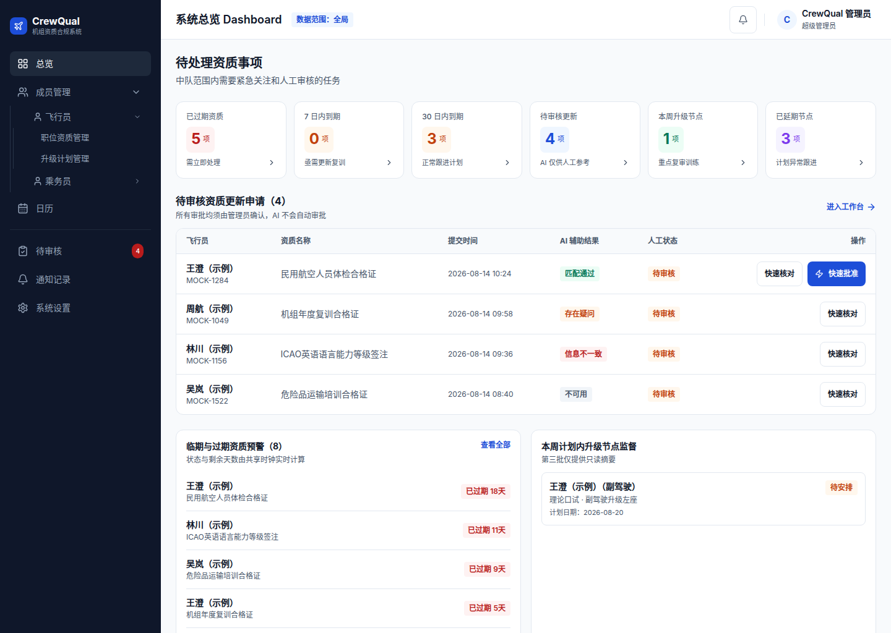
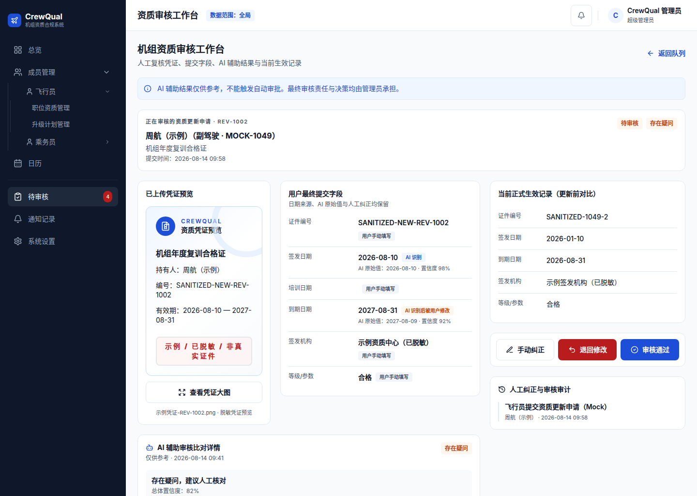
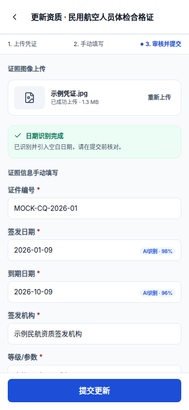
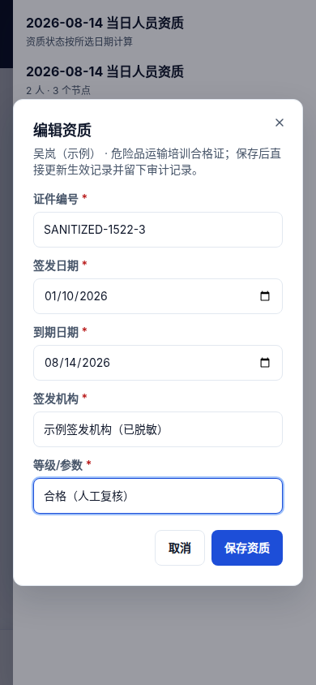

<div align="center">
  <h1>CrewQual</h1>
  <p><strong>Self-hosted personnel qualification and compliance management platform</strong></p>
  <p>Bring qualification records, expiration alerts, document submissions, AI-assisted verification, manual review, and progression plans into one traceable workflow.</p>
  <p>
    
    
    
    
  </p>
  <p><a href="./README.md"><kbd>简体中文</kbd></a> · <kbd><strong>English</strong></kbd></p>
  <p><a href="#quick-start">Quick Start</a> · <a href="./wiki/README.md">Wiki</a> · <a href="./docs/en/README.md">Technical docs</a> · <a href="#saas-and-enterprise-services">SaaS and Enterprise Services</a></p>
</div>

<p align="center">
  
</p>

> The screenshots contain no real personnel information.

## One complete qualification management workflow

CrewQual is a modern, self-hosted personnel qualification and compliance management platform.

It is designed for aviation organizations and other teams that continuously manage licenses, training, expiration dates, and personnel progression.

It brings personnel qualifications, expiration alerts, document submissions, assisted verification, manual review, and progression plans into one unified, traceable, and auditable workflow.

| Administration                             | Member experience                                 | Platform capabilities                 |
| ------------------------------------------ | ------------------------------------------------- | ------------------------------------- |
| Qualification and position rules           | Mobile qualification lookup                       | Docker Compose self-hosting           |
| Expiration alerts and unified calendar     | Credential capture or upload                      | PostgreSQL and private object storage |
| AI-assisted verification and manual review | Expiration-date recognition and manual correction | Access control and audit logging      |
| Personnel records and progression plans    | Progress and upcoming-expiration reminders        | Health checks, backup, and recovery   |

## Docs and Wiki

The [Wiki](./wiki/README.md) covers product concepts, member workflows, administrator workflows, and common questions. The [technical docs](./docs/en/README.md) cover installation, configuration, updates, backups and recovery, local development, and architecture. Every topic has Chinese and English pages with a language link at the top.

## Product tour

<p><strong>Human review workspace</strong></p>

<p align="center">
  
</p>

<p><sub>Compare credentials, member-submitted fields, AI-assisted results, and the current active record side by side. The final decision is always made by an authorized administrator.</sub></p>

<table>
  <tr>
    <td width="50%" valign="top">
      <strong>Member credential upload</strong><br><br>
      <p align="center"></p>
      <br><sub>Dates are recognized automatically after upload. Members can review, correct, and submit the update, while manual entry remains available when AI is unavailable.</sub>
    </td>
    <td width="50%" valign="top">
      <strong>Administrator mobile qualification maintenance</strong><br><br>
      <p align="center"></p>
      <br><sub>Administrators can verify and correct the current active record on mobile. Saving immediately updates the qualification and writes an audit log.</sub>
    </td>
  </tr>
</table>

## Why CrewQual

- **Designed around the complete workflow**: covers expiration reminders, member submissions, document recognition, human review, record activation, and result notifications.
- **Human decisions come first**: AI/OCR reduces data-entry and verification effort but never approves qualification updates automatically.
- **Adaptable to different positions and paths**: positions, qualification requirements, validity periods, reminder rules, and progression stages are configurable.
- **Built for mobile and desktop**: member workflows are optimized for phones, while the administration console supports centralized review and risk management.
- **Deployment-owner data control**: business data is stored in PostgreSQL, while credential images can be kept in private S3-compatible object storage.
- **Auditable and recoverable**: critical actions are logged, with background jobs, health checks, backup, and recovery support.

## How CrewQual differs from multidimensional table tools

CrewQual is a better fit when qualification compliance is a long-term, business-critical process that requires systematic management.

- A ready-to-use business model: personnel, positions, qualifications, expiration dates, review records, and progression plans are built in, so there is no need to design a complex table structure from scratch.
- A complete qualification workflow: covers document submission, AI-assisted verification, manual review, record activation, expiration alerts, and notifications.
- Stronger business constraints: qualification statuses, rule versions, evidence ownership, and review permissions are enforced consistently by the system, reducing accidental changes, missing configuration, and inconsistent rules.
- Dedicated experiences for different roles: members use a mobile portal for queries and submissions, while administrators use a workspace for reviews and risk management instead of sharing one complex table.
- Business-level auditability: records not only who changed which field, but also review decisions, applied rules, evidence, and complete state transitions.
- Independent deployment and data control: supports self-hosting, with direct control over the database, credential files, backup policies, and external-service integrations.
- Deep customization: the code can be adapted to an organization's position structure, qualification rules, progression paths, and approval policies.

## Quick start

Supports amd64 Linux hosts and Windows x86_64 with WSL2 Ubuntu using Docker Desktop Linux containers. Full arm64 and macOS testing is not yet complete.

```sh
curl -fsSL https://raw.githubusercontent.com/FlightDan/crewqual/main/install.sh | sudo bash
```

After installation, the terminal displays an 8-digit first-setup authorization code once. Visit the displayed `/setup` URL to complete initialization.

In an interactive terminal with UTF-8 and ANSI support, the installer automatically opens a full-screen CUI. Use Up/Down or number keys to select and Enter to confirm. During installation, the header shows overall progress while the middle pane streams Docker, download, and database logs; Ctrl+C cancels safely. On success or failure, the CUI restores the original terminal and leaves a copyable summary.

Unattended runs, non-TTY output, `TERM=dumb`, and terminals smaller than `64x20` automatically use plain text. Pass `--plain` to disable the CUI explicitly; `NO_COLOR=1` disables colors without disabling the full-screen layout. Complete raw CUI logs are stored with root-only permissions in `/opt/crewqual/logs/install-*.log`; failures show the path and recent output automatically. The initial setup authorization code is never written to this log.

### Windows with WSL2

Docker Desktop is installed and runs on Windows, while the CrewQual installation script always runs in the WSL2 Ubuntu terminal:

1. Enable the current Ubuntu distribution under Docker Desktop `Settings > Resources > WSL Integration`.
2. In Ubuntu, verify that both `docker info` and `docker compose version` succeed.
3. Run the CrewQual installation command above in Ubuntu without `--install-docker`.

WSL2 automatically uses manual update mode and binds only to `http://localhost:8080` by default, which is directly accessible from a Windows browser. To upgrade, rerun the same installation command in Ubuntu. For phones or other LAN devices, pass the private IPv4 address of the Windows network adapter:

```sh
curl -fsSL https://raw.githubusercontent.com/FlightDan/crewqual/main/install.sh \
  | sudo bash -s -- --network-mode lan --lan-address 192.168.1.20
```

You must also allow the selected inbound TCP port through Windows Firewall. Do not use the changing WSL2 internal `172.x` NAT address. If `docker info` fails, start Docker Desktop and recheck WSL Integration for the Ubuntu distribution.

By default, the installer resolves the latest stable official GitHub Release and does not include release candidates. To install the latest RC, explicitly pass `--channel rc`.

On first installation, choose Chinese or English and one of two deployment modes:

- **LAN testing** uses port `8080` by default and requires no domain or TLS email. The installer then asks whether access should remain LAN-only; answer no to temporarily access a VPS through its public IP over HTTP.
- **Configure TLS now** binds a production domain and obtains a certificate through ACME / Let's Encrypt.

If you already have a certificate from a CA or cloud provider, use custom certificate mode during the first installation:

```sh
curl -fsSL https://raw.githubusercontent.com/FlightDan/crewqual/main/install.sh \
  | sudo bash -s -- --network-mode tls \
      --domain crewqual.example.com \
      --tls-cert /etc/ssl/crewqual/fullchain.pem \
      --tls-key /etc/ssl/crewqual/privkey.pem \
      --port 443
```

`--tls-cert` must be a PEM server certificate or full chain, and `--tls-key` must be its matching unencrypted PEM private key. The installer checks certificate expiry, hostname coverage, and the certificate/key pair, then copies them to `/opt/crewqual/tls/` for Caddy. Custom certificate mode does not require `--tls-email`; rerun the installer or `configure-domain.sh` with the renewed files after certificate renewal.

After a LAN installation, switch to a custom certificate with:

```sh
sudo /opt/crewqual/configure-domain.sh \
  --domain crewqual.example.com \
  --tls-cert /etc/ssl/crewqual/fullchain.pem \
  --tls-key /etc/ssl/crewqual/privkey.pem \
  --port 443
```

Without `--tls-cert` and `--tls-key`, the existing Caddy ACME automatic certificate mode remains in use. Issuing a new certificate does not automatically revoke an existing one; the old certificate remains valid until it expires or is separately revoked by its CA.

Public HTTP does not encrypt the first-setup authorization code, login credentials, TOTP, or business data. The installer requires another confirmation and displays a security warning. Use this mode only temporarily and restrict source addresses with a firewall. After configuring HTTPS, change the administrator password and TOTP, revoke all active sessions, and rotate any API or webhook keys entered during the HTTP phase. For unattended installation, explicitly use `--network-mode http --public-address <VPS_PUBLIC_IP>`.

After a LAN or temporary public-HTTP deployment, bind a production domain and enable TLS with:

```sh
sudo /opt/crewqual/configure-domain.sh \
  --domain crewqual.example.com --tls-email ops@example.com --port 443
```

The script enables public access only after certificate issuance and health checks succeed. If either step fails, it restores the previous LAN configuration. When using a custom TLS port, public TCP port 80 must still reach Caddy for ACME HTTP validation.

Install a fixed version:

```sh
curl -fsSL https://raw.githubusercontent.com/FlightDan/crewqual/main/install.sh \
  | sudo bash -s -- --version v1.0.1
```

Unattended installation on a regular Linux host:

```sh
curl -fsSL https://raw.githubusercontent.com/FlightDan/crewqual/main/install.sh \
  | sudo bash -s -- --install-docker --non-interactive \
      --network-mode lan --lan-address 192.168.1.20
```

Running the installation command again upgrades the existing deployment while preserving `/opt/crewqual/.env` and Docker volumes. The TLS email is used only for certificate expiration, renewal, or error notifications. It is not a CrewQual login account, and no email password is required.

## SaaS and enterprise services

CrewQual can be self-hosted and also offers managed services for enterprises and small teams, including:

- Fully managed hosting
- Data migration
- System configuration
- Operations and data backup
- Messaging-channel integrations
- Enterprise internal OA integrations
- Custom features and business-process adaptation

Contact: `CrewQual@devdan.cc`

## Roadmap

- [ ] One-click migration from multidimensional table tools
- [ ] Node.js 22 → 24
- [ ] Full support for ARM architectures and macOS

## Privacy and security

CrewQual is self-hosted by design. Unless the deployment owner explicitly configures external services or third-party integrations, personnel information, qualification records, and credential files remain on infrastructure controlled by the deployment owner.

AI-assisted verification is optional and does not affect the core workflow. Before enabling an external AI service, deployment owners should select a provider that meets applicable laws, confidentiality requirements, and data-processing policies.

CrewQual does not proactively send business data to third-party services unless configured to do so.

If you discover a security issue that may affect CrewQual, do not disclose exploitation details through a public Issue. Read [SECURITY.md](./SECURITY.md) or contact `CrewQual@devdan.cc`.

## Contributing

Contributions through Issues and Pull Requests are welcome for the code, tests, documentation, interface, and deployment workflow.

Code contributions must comply with [CLA.md](./CLA.md). See [CONTRIBUTING.md](./CONTRIBUTING.md) to learn how to participate.

## License

CrewQual is released under the GNU Affero General Public License v3.0 only (SPDX: `AGPL-3.0-only`). See [LICENSE](./LICENSE) for the complete terms.

You may use, deploy, study, modify, and redistribute CrewQual in accordance with the AGPL-3.0 terms.

If you modify CrewQual and make that modified version available to users over a network, ensure that the corresponding source code is made available to those users as required by AGPL-3.0.

CrewQual may offer alternative licensing options in the future, such as commercial licenses for organizations that require commercial deployments, managed services, custom development, or an arrangement without the open-source obligations of AGPL-3.0.

The applicable licensing terms are those in the repository's LICENSE file and any commercial licensing terms published later.

The explanations in this README are provided for guidance only. The full AGPL-3.0 text in LICENSE governs the specific rights and obligations.
